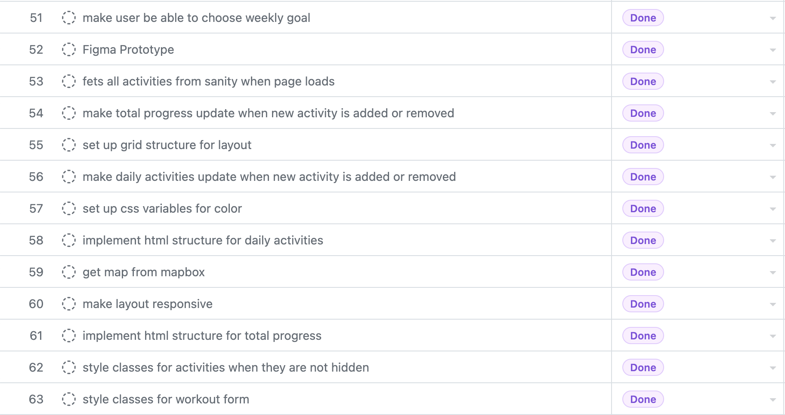
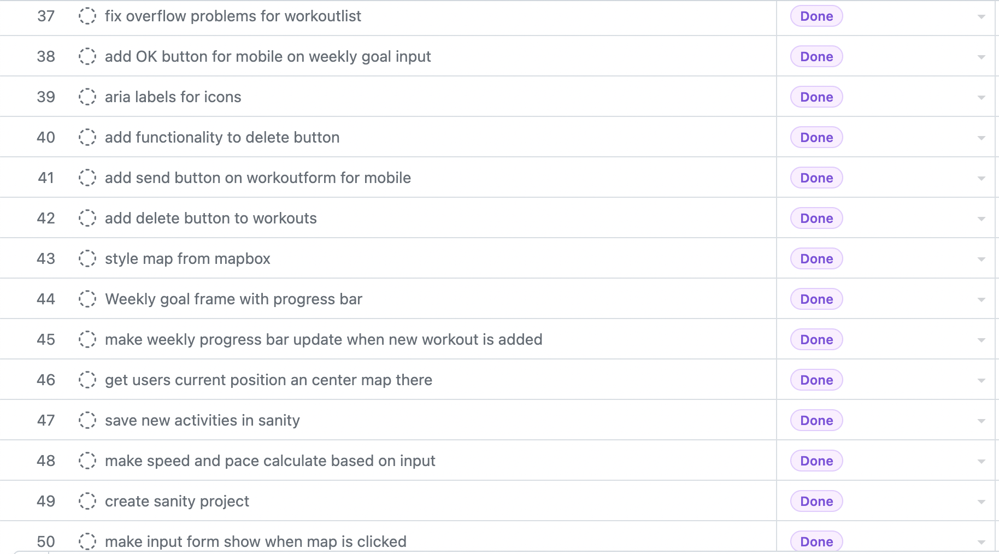
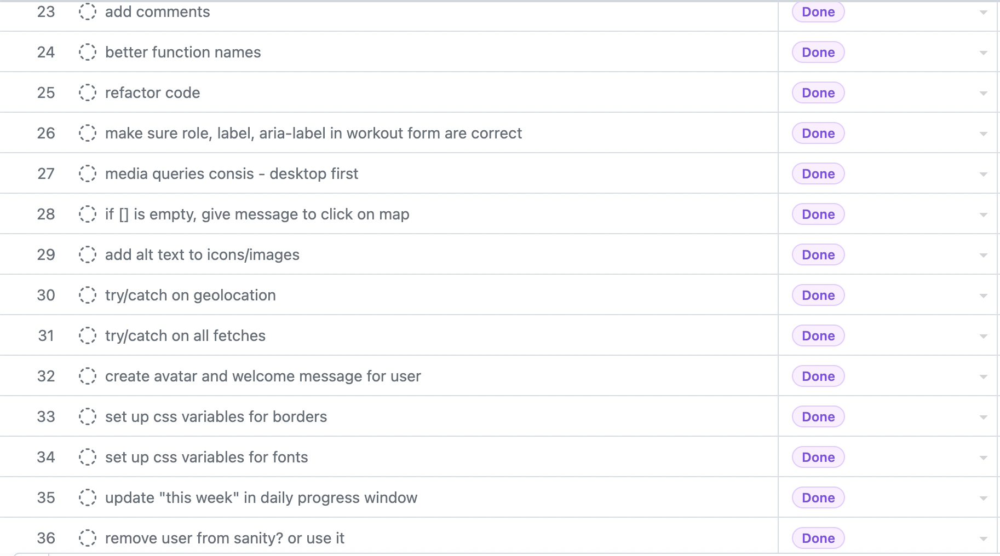

# Pacer - Workout Tracker
This is a simple workout tracker app created to track running and cycling workouts for a user. 

## About the project
This project is my final exam project in the study Front-End Developement at Høyskolen Kristiania. The project is created to show the 
skills and competence I have acquired throughout the course this year and to apply this competence in one last summarizing project. 

With this workout tracker you can track your running and cycling workouts and get an overview of your traning progress. The user sets a weekly goal
and for each workout that is added or deleted their progress will be displayed in the progress section of the application. In the progress section
you can see the weekly progress, total progress, as well as a daily overview of each type of activity. For the sake of simplicy the weekly 
overviews do not reset every week, but this is something i would like to implement in the future.

Some features you will find in this project:
- Responsive layout depending on the device screen size
- Keyboard navigation
- A data base with all workouts

### The project is bulit with

- Semantic HTML5 markup
- CSS custom properties
- Flexbox
- CSS Grid
- Dekstop-first workflow
- JavaScript
- Sanity Studio
- Sanity Query API and GROQ
- Mapbox

## Process
### Thought process and MVP
When i was starting to work on the project i sat down and wrote down what i wanted the application to be able to do. It started if as a very 
ambitious project with a lot of features. Because of the limimted time frame and also the fact that we only were to use vanilla JavaScript i had to 
simplify it a lot. In the two boxes you see what i ended up with as the minimum viable product and in the bottom left corner you see some of
the features i had to discard. 

In the image below you can se how i translated the MVP into my Github Project later.

The images below are screenshots from my Github Project Roadmap, showing the tasks that have been done and merged.

### Workflow diagram
To get a better understanding of the flow of my project i made a simple workflow diagram showing when i needed what to happen. 

### Data base model
Lasty I made an overview of my data base model and how i wanted it to be in Sanity. The data base is not very complex as it startes of empty before
the user adds workouts through the UI. There only exist one unique Settings schema and User schema as we only need one of each of these for the
application. The Workout schema on the other hand, is dynamically being added and removed by the user and they can create as many as they like.

## How to use the Project
### When you open the application
When you open the project a map will be centered around where you are at that specific time. I have added some workouts beforehand just to show you how the daily workouts tab displays workouts that gets added throughout the week, but these are placed around where I was when i had the application open. To find the workouts on the map you can click on the workouts in the list on the right side and the map will get centered on the clicked workout. From the list of workouts on the right you can also delete the previously added workouts to start with a clean project if you want. As i mentioned in the beginning, the progress sections do not reset every week for the sake of simplicity. So if you start adding workouts before deleting the old ones the progress will just be added on top of the workouts i added the week before. Everything will work just fine, but its a good thing to be aware of.

### Set weekly goal
You can set your own weekly goal by clicking (or tabbing) to the weekly goal section and chinging the number being displayed. This will change both the weekly progress and the daily progress to be relative to the weekly goal.

### Add a workout
To add a workout you simply click the map where you had your workout and add the data into the workout form showing. When the form gets submitted, the workout will be rendered on the map and in the list on the right side. All the progress sections will also get updated.

### Remove a workout
To remove a workout, simply click on the trash can icon on the workout element you would like to delete and everything will be updated accordingly.

## Links
- Github Repository: https://github.com/saratyldum/Pacer-workout-tracker
- Sanity Studio: https://pacer.sanity.studio/workouts
- Netlify: https://pacer.netlify.app/
